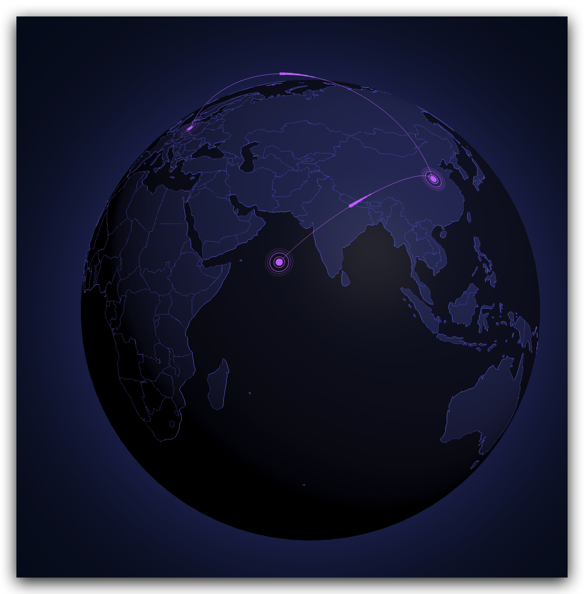

# earthFlywire

## 项目介绍

基于three.js 构建3D大屏地球可视化，居家必备，搬砖神器节约时间。

## ✨ 特性

+ 📦 开箱即用：简单快速集成，基本零成本上手。
+ 🛡 Typescript开发：提供完整的类型定义文件。

## 目录

- [使用说明](#使用说明)
  - [事例](#🐸 示例)
- [文档](#📄 文档)
- [本地构建](#🛠️ 本地构建)


# 使用说明

```bash
npm install earth-flywire -S
```


## 🐸 示例

```javascript
import earthFlywire from "earth-flywire";
//请先下载地图文件 然后注册地图
import geojson from 'xxx/path/world.json'
chart.registerMap("world", geojson);
//获取dom节点作为容器 注：该节点请设置宽高
const dom = document.getElementById("container");
const chart = earthFlywire.init({
      dom,
      map: "world",
    });
chart.addData("flyLine", [
 {
   from:{
      lon: 112.45, //经度
      lat: 34.62, //维度
     ...extraField // 其他自定义字段
    },
    to:{
      lon: 14, //经度
      lat: 52, //维度
      ...extraField // 其他自定义字段
    },
 }
])
.then(() => {
  console.log('塞入数据成功');
});
```


### 😱先这样，然后再那样，成了！🙀



## 📄 文档
```javascript
earthFlywire.init({
	dom,
	config:{
    	R: 150,//地球半径
      earth: {
        color: "#13162c",//地球的颜色
      },
      mapStyle: {
        areaColor: "#2e3564",//地图区域颜色
        lineColor: "#797eff",//地图边界线颜色
      },
      spriteColor: "#797eff", //光圈颜色
      scatterColor: "#cd79ff", //涟漪
      trackColor: "#cd79ff", //轨道色
      flyWireColor: "#cd79ff", //蝌蚪飞线颜色
    };
	}
})

```


## 🛠️ 本地构建
在根目录下执行命令，需要[Node.js](https://nodejs.org)(v16+版本)环境。
```bash
# 通过 npm 安装依赖
npm install

# 打包文件
npm run build
```
构建好的文件在`dist`文件夹。

### 注意事项

在这里输入注意事项，可以包括使用过程中需要注意的事项、常见问题解决方法等。

### 版本历史

在这里输入版本历史，可以包括每个版本的更新内容、修复的bug等。

### 联系方式

在这里输入联系方式，可以包括作者的联系方式、项目的官方网站等。
